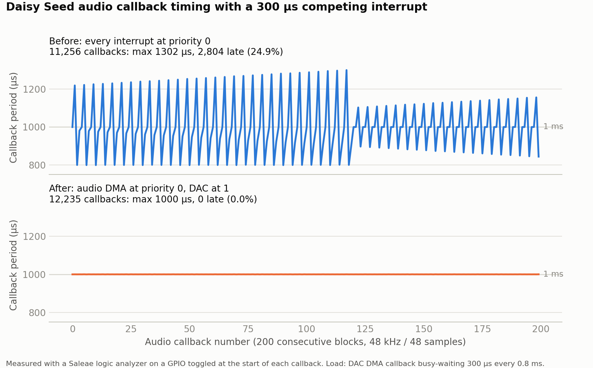

# IRQ jitter test

Measures how late the libDaisy audio callback starts when another interrupt is running. It is the test behind the `irq-priorities` branch: on stock libDaisy nearly every interrupt is at NVIC priority 0, so the audio DMA interrupt cannot preempt a slow driver interrupt and has to wait for it to finish.



| | Before (stock priorities) | After (`irq-priorities`) |
|---|---|---|
| Callbacks measured | 11,256 | 12,235 |
| Period p50 | 999.7 µs | 999.8 µs |
| Period p99 | 1293 µs | 1000.0 µs |
| **Period max** | **1302 µs** | **1000.0 µs** |
| **Late callbacks (> 1010 µs)** | **2,804 (24.9 %)** | **0** |

## How it works

- **Audio:** 48 kHz, block size 48, so the callback should run every 1 ms. A GPIO is high while it runs.
- **Load:** the DAC's DMA callback busy-waits 300 µs every 0.8 ms, standing in for a slow interrupt handler (SD card, display flush, USB). Its period is deliberately not a multiple of 1 ms, so the two interrupts drift through every overlap phase within a few seconds.
- **Before:** audio and DAC share priority 0, so a callback that's due while the DAC handler runs is delayed by up to 300 µs.
- **After:** audio is at 0 and the DAC at 1, so audio preempts it.

## Hardware

A Daisy Seed (it was tested in a Daisy Pod) and a logic analyzer. The results above were captured with a Saleae.

| Analyzer channel | Seed pin | Signal |
|---|---|---|
| Audio | D7 | High during each audio callback |
| Load | D8 | High during each DAC DMA callback |
| Mark | D9 | Toggles once per second (main loop alive) |
| GND | GND | |

On a Daisy Pod, D7–D9 are the SPI1 header pins. **Don't use D1–D6 on a Pod:** they are its SD card lines. D22 carries the DAC output; leave it unconnected.

## Build

This folder builds against a libDaisy checkout with CMake (Arm GNU Toolchain on the PATH). By default it uses the checkout it lives in.

**Before** (stock priorities), from this branch:

```bash
cmake -S tools/irq_jitter_test -B build_jitter_before -G Ninja -DCMAKE_BUILD_TYPE=Release
cmake --build build_jitter_before
```

**After:** build against a checkout of the `irq-priorities` branch, for example a worktree:

```bash
git worktree add ../libDaisy-irq irq-priorities
cmake -S tools/irq_jitter_test -B build_jitter_after -G Ninja -DCMAKE_BUILD_TYPE=Release -DLIBDAISY_DIR=../libDaisy-irq
cmake --build build_jitter_after
```

Flash `irq_jitter_test.hex` (ST-Link / STM32CubeProgrammer) or a `.bin` made with `arm-none-eabi-objcopy -O binary` (Daisy Web Programmer).

## Capture and analyze

1. Name the analyzer channels **Audio**, **Load** and **Mark**, and capture about 10 s of each firmware.
2. Export each capture as CSV (Logic 2: *File → Export Data → CSV*).
3. Compare them:

```bash
python analyze.py before.csv after.csv -o chart.png
```

The chart needs matplotlib; the statistics don't.

## Notes

- **This is a timing test, not an audio-quality test.** The load makes the CPU swing between a 300 µs busy-wait and idle 1,250 times a second, and on a Daisy Pod that supply-current pattern is audible as a low whine (around 1 kHz) in the passthrough audio. The same board passes audio cleanly without the load: a passthrough build with the SAI's overrun/underrun flag monitored ran 13.6 minutes with no errors and no audible noise. The whine is electrical, not lost samples.
- **The main loop contains a compiler barrier** (`__asm volatile("" ::: "memory")`). Without it, a CMake/LTO build of stock libDaisy can lose the audio callback entirely: GCC deletes the store of the callback pointer in `StartAudio()`, because this loop never reads it, and the output becomes a steady tone. That bug is fixed separately on the `audio-callback-volatile` branch. The barrier keeps this test working on unpatched libDaisy.
- **About the included data:** `data/before.csv` and `data/after.csv` were captured with an earlier version of this program, which got around the lost-callback bug by building against the `audio-callback-volatile` fix rather than using the barrier. Their timing behavior is the same as this version's.
- **Audio interrupt overhead:** after the change, the DAC's 300 µs pulse stretches to about 315 µs, because the audio interrupt now preempts it. That puts libDaisy's whole audio interrupt at about 14 µs per block, including the int↔float conversion. The callback itself takes 0.5 µs here.
